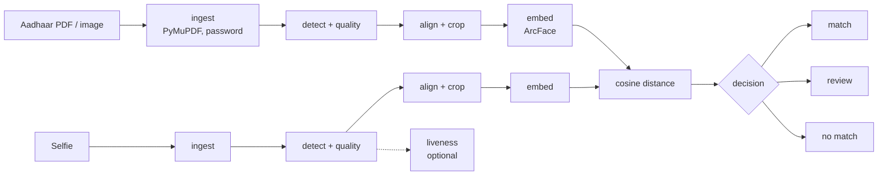

# Video KYC Face Verification

[](https://github.com/AditiiSharma2204/Video-KYC-face-verification/actions)


Verify that a **live selfie** belongs to the person pictured on an **Aadhaar document** (e-Aadhaar PDF or scanned image).
Ships as a Python library, a REST API and a Streamlit app.

Evolved from an original ~100-line Streamlit prototype into a tested, configurable verification pipeline.

## What's different from the prototype

| Prototype | This version |
|---|---|
| Haar cascade, takes `faces[0]` | YuNet detector, picks the largest/most confident face, Haar kept as offline fallback |
| Raw crop, no alignment | Eye-level alignment from 5 facial landmarks, single affine warp with edge padding |
| `DeepFace.verify` defaults (VGG-Face), `enforce_detection=False` | Explicit model choice (ArcFace default), own detection so "no face" is an error rather than a silent match on garbage |
| Binary verdict | Three-way decision: **match / review / no match**, with a configurable uncertainty band |
| No quality checks | Blur, exposure and face-size gates on the selfie; warnings on the (inevitably tiny) Aadhaar photo |
| No anti-spoofing | Optional passive liveness check (DeepFace Fasnet) |
| `poppler` needed for PDFs; encrypted PDFs fail | PyMuPDF: no system dependency, password-protected e-Aadhaar PDFs supported |
| Face crops written to temp dirs and never deleted | Everything in memory, nothing persisted |
| No tests, no API, no evaluation | 46 unit/API tests, FastAPI service, ROC/EER benchmark harness, Docker, CI |

## Architecture



Each stage is a small module in [`src/facematch/`](src/facematch): `ingest`, `detection`, `quality`, `embedding`, `liveness`, `matching`, wired together by `pipeline.FaceMatchPipeline`. Detector, embedder and liveness checker are injected (`Protocol`s), which is how the test-suite runs the whole pipeline without TensorFlow.

### How the decision works

Embeddings are compared by cosine distance against a per-model threshold (DeepFace's LFW-tuned values by default, calibratable with the evaluation tool below):

- `distance <= threshold x (1 - margin)` -> **match**
- `distance >  threshold x (1 + margin)` -> **no match**
- in between -> **review** (route to a human instead of forcing a coin-flip)

`margin` defaults to 0.15 (`Config.review_margin`).

## Quick start

Requires Python 3.10-3.12 (TensorFlow does not yet cover newer versions on every platform).

```bash
git clone https://github.com/AditiiSharma2204/Video-KYC-face-verification && cd Video-KYC-face-verification
python -m venv .venv && source .venv/bin/activate      # Windows: .venv\Scripts\activate
pip install -e ".[ml,api,app]"
```

**Streamlit app**
```bash
streamlit run app/streamlit_app.py
```

**REST API**
```bash
uvicorn facematch.api:app --port 8000        # docs at http://localhost:8000/docs

curl -X POST localhost:8000/verify \
  -F document=@aadhaar.pdf -F password=ABCD1990 -F selfie=@selfie.jpg
```
```json
{
  "decision": "match", "verified": true,
  "distance": 0.4123, "threshold": 0.68, "similarity": 69.7,
  "model": "ArcFace", "detector": "yunet", "liveness_score": null,
  "document_quality": {"sharpness": 88.1, "brightness": 121.3, "face_px": 96, "issues": []},
  "selfie_quality":   {"sharpness": 402.7, "brightness": 128.9, "face_px": 310, "issues": []},
  "timings_ms": {"ingest": 210.4, "detect": 45.2, "embed_and_match": 380.9}
}
```
(Illustrative response shape.) Errors return `{"error": "<code>", "detail": "..."}` with `401 password_required | wrong_password`, `400 invalid_document`, `422 no_face_detected | low_quality_image`, `403 spoof_detected`.

> e-Aadhaar PDFs are encrypted: the password is the first 4 letters of your name in CAPITALS followed by your year of birth (`YYYY`).

**Library**
```python
from facematch import FaceMatchPipeline, Config

pipe = FaceMatchPipeline(Config(model_name="ArcFace", liveness=False))
result = pipe.verify(open("aadhaar.pdf", "rb").read(), open("selfie.jpg", "rb").read(), password="ABCD1990")
print(result.decision, result.distance)
```

**Docker**
```bash
docker build -t video-kyc-face-verification . && docker run -p 8000:8000 -v fm-models:/models video-kyc-face-verification
```

Configuration for the API/Docker is via environment: `FACEMATCH_MODEL`, `FACEMATCH_DETECTOR`, `FACEMATCH_THRESHOLD`, `FACEMATCH_LIVENESS=1`.

## Evaluation

Don't trust default thresholds blindly - measure them. The benchmark builds genuine/impostor pairs from any identity-folder dataset (e.g. [LFW](http://vis-www.cs.umass.edu/lfw/)), computes ROC / AUC / EER / TAR@FAR, and reports the balanced-accuracy-optimal threshold.

```bash
pip install -e ".[ml,eval]"
python -m facematch.evaluate --data path/to/lfw --model ArcFace --pairs 1000
python -m facematch.evaluate --data path/to/lfw --model ArcFace --pairs 1000 --degrade   # Aadhaar-like reference photos
```

`--degrade` shrinks and JPEG-compresses the reference image to mimic the small portrait on an Aadhaar card, so you can see how much accuracy that costs. Results land in `results/` (JSON + ROC plot).

| Model | Detector | Reference photos | AUC | EER | Best threshold |
|---|---|---|---|---|---|
| _run the commands above and fill in your own numbers_ | | | | | |

## Development

```bash
pip install -e ".[dev]"
ruff check src tests app
pytest
```

The tests cover matching/decision logic, metrics, alignment geometry, quality gates, encrypted-PDF ingestion, the pipeline (including liveness and error paths) and the HTTP API, all with injected fakes so CI stays fast and TensorFlow-free.

## Privacy and limitations

- Aadhaar numbers are sensitive personal data (Aadhaar Act 2016, DPDP Act 2023). This tool keeps images in memory only, never logs them, and never persists them. **Do not commit real Aadhaar documents or selfies**; `.gitignore` excludes `*.pdf`.
- Face matching is probabilistic. Treat `review` as a genuine outcome and keep a human in the loop for consequential decisions.
- Passive liveness stops printed photos and screen replays, not determined attackers (3D masks, camera injection).
- Aadhaar portraits are small and heavily compressed, which raises error rates compared with benchmark photos; use `--degrade` to quantify it.
- This project is not affiliated with UIDAI and is not a substitute for UIDAI's official Aadhaar face-authentication service.

## Project layout

```
src/facematch/   library: ingest, detection, quality, embedding, liveness, matching, pipeline, api, evaluate, metrics
app/             Streamlit UI
tests/           pytest suite (no TensorFlow required)
Dockerfile       API image
.github/         CI (ruff + pytest on Python 3.10 and 3.12)
```
