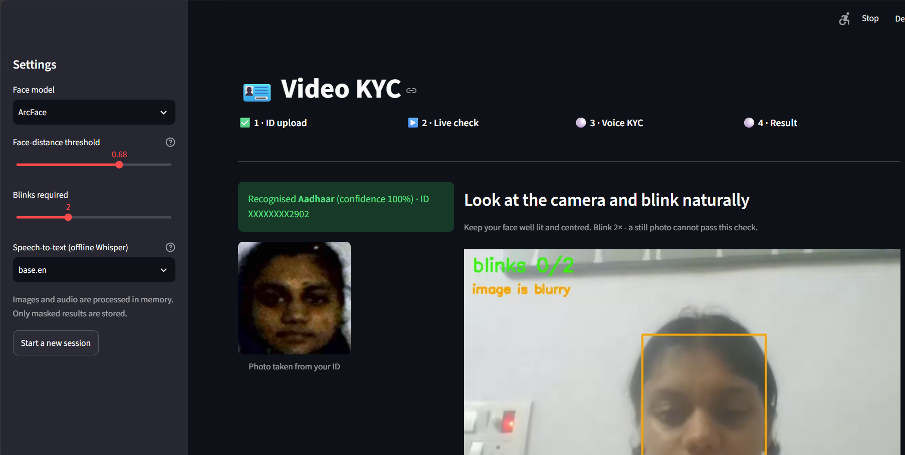
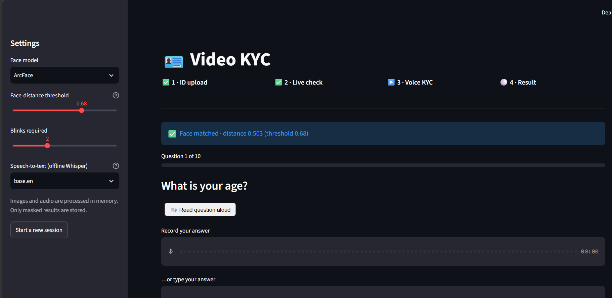
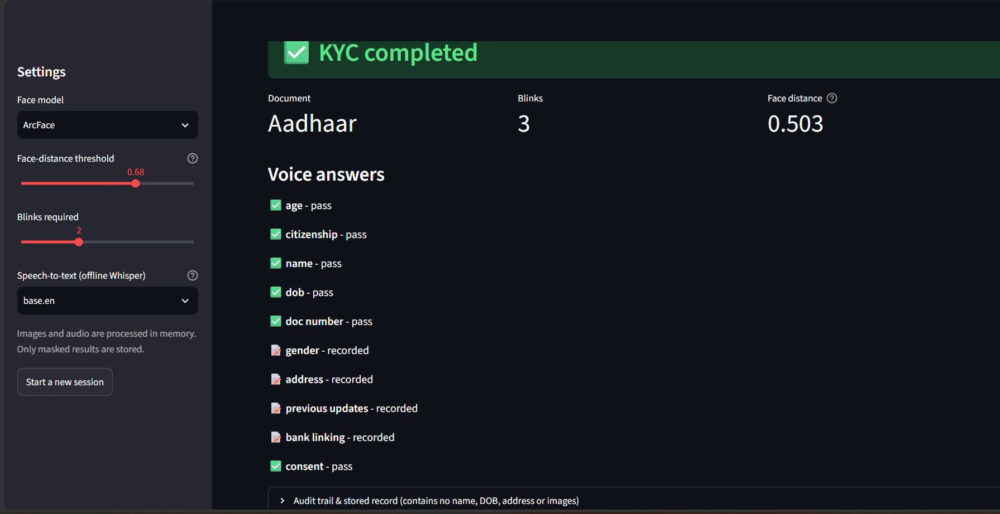

# Video KYC Face Verification

[](https://github.com/AditiiSharma2204/Video-KYC-face-verification/actions)


An end-to-end **Video KYC** pipeline: read and classify a government ID with OCR, prove the person
in front of the camera is live and matches the ID photograph, then confirm the ID's details by voice.
It ships as a Python library, a REST API and a Streamlit app, and stores only a masked, PII-free record.

```
Upload ID ─► validate ─► OCR (Tesseract) ─► classify (Aadhaar · PAN · Passport · Voter ID · Driving Licence)
                                              │
                                              └─► extract fields + ID photograph
Live webcam ─► face detection ─► blink liveness ─► image-quality gate ─► ArcFace verification
                                                                          │
                                        no match ─► Reject                └─► match ─► Voice KYC (10 questions)
                                                                                          │
                                                                              MongoDB (masked record) ─► KYC completed
```

## Screenshots

**1 · ID upload and live check.** The Aadhaar card is recognised and its number masked, and the photo is cut out of
the ID. The webcam feed counts blinks and warns about blurry frames, so a still photo can't pass.



**2 · Voice KYC.** The live face matched the ID photo (ArcFace distance 0.503, below the 0.68 threshold). Ten
questions follow; each can be read aloud and answered by voice (offline Whisper) or by typing.



**3 · Result.** KYC is completed. Answers that can be checked against the ID pass or fail; the rest are recorded. The
stored audit record contains no name, date of birth, address or images.



## Highlights

* **Five ID types recognised** by an explainable rules engine that scores keywords *and* structurally validated ID
  numbers (Verhoeff checksum for Aadhaar, PAN holder-type check, licence-year check, passport MRZ check digits).
* **Checksum-gated OCR repair**: `O`↔`0`, `I`↔`1`, `S`↔`5`, `B`↔`8` are fixed only where the ID format demands it
  *and* the validator accepts the result. Word-confidence filtering strips junk that photos and holograms add.
* **Blink liveness** from MediaPipe's 478 landmarks: eye-aspect-ratio with a per-user adaptive threshold, timestamp-based
  timing (frame-rate independent), and rejection of held-shut eyes and landmark jitter.
* **Face verification tuned for tiny ID photos**: YuNet detection, the exact 5-point ArcFace alignment, the median over the
  best live frames, and a three-way `match / review / no match` decision.
* **Voice KYC with 10 questions**, offline Whisper transcription, and answers verified against what was read from the ID
  (spoken dates, numbers, letters and names are all normalised).
* **Privacy by construction**: in-memory processing; the store keeps verdicts, scores, a *masked* ID (`XXXXXX234F`) and an
  HMAC for duplicate detection: no name, DOB, address, transcript, image or audio.
* **Engineering**: 285 tests, ruff-clean, dependency-injected stages, FastAPI + Streamlit + CLI, Docker/Compose, CI, and an
  evaluation harness with ROC/EER.

## Measured results

Face verification on **LFW** (400 genuine + 400 impostor pairs, seed 42, YuNet + ArcFace). "Degraded" shrinks and
JPEG-compresses the reference photo (face ~70 px, quality 45) to mimic an ID portrait.

| Alignment | Reference photo | AUC | EER | TAR @ FAR 1 % | TAR @ FAR 0.1 % | Best threshold |
|---|---|---|---|---|---|---|
| **5-point ArcFace template** (default) | clean | **0.998** | **2.5 %** | **96.8 %** | 92.5 % | 0.695 |
| **5-point ArcFace template** (default) | degraded, ID-like | **0.994** | **2.75 %** | **95.5 %** | 89.8 % | 0.696 |
| generic box crop (first version) | clean | 0.902 | 16.0 % | 15.0 % | 13.0 % | 0.642 |
| generic box crop (first version) | degraded, ID-like | 0.854 | 21.5 % | 12.5 % | 5.5 % | 0.577 |

The alignment change alone cut EER from 16 % to 2.5 % (21.5 % to 2.75 % on ID-like photos). It was found by an
end-to-end test in which a *different* person matched an ID photo; see [docs/DESIGN.md](docs/DESIGN.md).
Raw output: [`docs/results/`](docs/results).

Read these numbers with care: LFW pairs are easier than real KYC traffic, impostors are random rather than look-alikes,
and 400 pairs per class means wide error bars (TAR at 0.1 % FAR is one false accept in 400 impostor pairs). The default
threshold (0.68) sits slightly stricter than the best-accuracy point, the safer side for KYC. Calibrate on your own
data before relying on it.

Document OCR was checked on rendered ID cards of all five types (skewed, noisy, with a photo beside the text) and on
synthesised speech through Whisper; those are functional checks, not a benchmark.

## How it works

| Stage | Module | What it does |
|---|---|---|
| Intake | `document/intake.py` | magic-byte sniffing, 15 MB / 50 MP caps, PyMuPDF rendering, encrypted-PDF passwords (e-Aadhaar) |
| OCR | `document/preprocess.py`, `ocr.py`, `ocr_text.py` | deskew, CLAHE, denoise, Otsu; two variants; best by confidence mass |
| Classification | `document/classify.py`, `validators.py` | keyword + validated-number scoring, per-decision evidence |
| Extraction | `document/extract.py` | name, DOB / YOB, gender, number, address, father's name; passport MRZ |
| Face | `face/detection.py`, `quality.py`, `embedding.py`, `matching.py` | YuNet, ArcFace 5-point alignment, quality gates, cosine distance |
| Liveness | `liveness/blink.py`, `capture.py`, `landmarks.py` | EAR + blink state machine, best-frame selection, video decoding |
| Voice | `voice/parsing.py`, `questions.py`, `flow.py`, `stt.py` | spoken-answer normalisation, 10 questions, retries, faster-whisper |
| Session | `session/engine.py` | explicit state machine, audit trail, duplicate-ID detection, TTL |
| Storage | `storage/` | MongoDB (TTL retention) or in-memory |

Design rationale, trade-offs and the honest limits are in **[docs/DESIGN.md](docs/DESIGN.md)**.

## Quick start

**1. System dependency: the Tesseract OCR binary**

```bash
# Windows                    winget install UB-Mannheim.TesseractOCR
# macOS                      brew install tesseract
# Debian / Ubuntu            sudo apt install tesseract-ocr libgl1
```

**2. Python 3.10 - 3.12** (TensorFlow, used by DeepFace, doesn't cover newer versions everywhere)

```bash
git clone https://github.com/AditiiSharma2204/Video-KYC-face-verification && cd Video-KYC-face-verification
python -m venv .venv && source .venv/bin/activate          # Windows: .venv\Scripts\activate
pip install -e ".[all]"                                     # or pick extras: ml, liveness, voice, mongo, api, app
```

**3. Run it**

```bash
streamlit run app/streamlit_app.py            # guided UI: ID -> webcam -> voice -> result
uvicorn videokyc.api:app --port 8000          # REST API, docs at http://localhost:8000/docs
docker compose up --build                     # API + MongoDB (set KYC_HASH_KEY first)
```

Model weights (ArcFace, YuNet, MediaPipe, Whisper) download on first use.

## REST API

| Method & path | Purpose |
|---|---|
| `POST /v1/sessions` | start a session |
| `POST /v1/sessions/{id}/document` | upload ID (PDF/JPG/PNG) `+ password` -> OCR, classification, ID photo |
| `POST /v1/sessions/{id}/video` | upload a short webcam clip -> blink liveness + face match |
| `GET  /v1/sessions/{id}/question` | current voice question |
| `POST /v1/sessions/{id}/answer` | `{"transcript": "..."}` |
| `POST /v1/sessions/{id}/answer/audio` | audio file, transcribed offline |
| `GET  /v1/sessions/{id}` | PII-free summary and audit trail |
| `POST /v1/face/verify` | stateless ID-photo vs selfie comparison |

```bash
SID=$(curl -s -X POST localhost:8000/v1/sessions | jq -r .session_id)
curl -F file=@pan.png            localhost:8000/v1/sessions/$SID/document
curl -F video=@blink.mp4         localhost:8000/v1/sessions/$SID/video
curl -X POST -H 'content-type: application/json' -d '{"transcript":"thirty six"}' localhost:8000/v1/sessions/$SID/answer
```

Errors are `{"error": "<code>", "detail": "..."}`: `401 password_required | wrong_password`,
`400 invalid_document`, `422 unsupported_document | no_face_detected | low_quality_image | liveness_failed`,
`403 spoof_detected`, `404 session_not_found`, `409 invalid_session_state`, `503 ocr_unavailable`.

## Configuration

| Variable | Meaning |
|---|---|
| `FACEMATCH_MODEL` / `FACEMATCH_DETECTOR` / `FACEMATCH_THRESHOLD` | face model (`ArcFace`, `Facenet512`, ...), detector, distance threshold |
| `FACEMATCH_LIVENESS=1` | add DeepFace's passive anti-spoof check on the live frame |
| `KYC_STT` / `KYC_WHISPER_MODEL` | `whisper` (default) or `none`; e.g. `tiny.en`, `base.en`, `small.en` |
| `KYC_OCR_LANG` / `TESSERACT_CMD` | Tesseract languages (`eng+hin`) / path to the binary |
| `MONGO_URI` / `MONGO_DB` / `MONGO_TTL_DAYS` | persistence (in-memory if unset) and record retention |
| `KYC_HASH_KEY` | **secret** for the keyed ID hash; set it in any real deployment |

Policy knobs (blinks required, retries, failure tolerance, borderline handling) live in `KycConfig`, `BlinkConfig`, `VoiceConfig`.

## Evaluation

```bash
pip install -e ".[all]"
python -m videokyc.face.evaluate --data path/to/lfw --model ArcFace --pairs 400 --alignment arcface
python -m videokyc.face.evaluate --data path/to/lfw --model ArcFace --pairs 400 --alignment arcface --degrade
python -m videokyc.tools.blink_demo          # check blink thresholds on your own camera
```

`--degrade` shrinks and JPEG-compresses the reference photo to mimic an ID portrait. Results (JSON + ROC plot) land in
`results/`. Use the reported threshold to calibrate `FACEMATCH_THRESHOLD` for your data.

## Testing

```bash
pip install -e ".[dev]" && pytest && ruff check src tests app
```

The suite injects fake detectors, embedders, eye trackers and speech-to-text, so it runs in seconds without TensorFlow,
MediaPipe or Whisper, while still driving the *whole* session engine (all stages, retries, rejections, storage, API).
Tests that use the real Tesseract binary run when it is installed (CI installs it) and skip otherwise. Beyond unit
tests, the real components (Tesseract, YuNet, ArcFace, MediaPipe landmarks, Whisper) were also exercised together
end-to-end on rendered ID cards and synthesised speech: a genuine user is approved, a still photo fails liveness and a
different person is rejected.

## Privacy and security

* Uploads are processed in memory. Video is spooled to a temp file only long enough to decode and is deleted immediately.
* Persisted: stage, verdicts, scores, doc type, masked ID, keyed hash, audit events. Never persisted: images, audio,
  transcripts, name, DOB, address. A test serialises the stored record and searches it for the PII strings.
* IDs already approved earlier are flagged and routed to manual review; Mongo records can auto-expire.
* Aadhaar data is sensitive (Aadhaar Act 2016, DPDP Act 2023). **Never commit real IDs, selfies or recordings**; `.gitignore`
  excludes PDFs, audio and video.

## Limitations

* This demonstrates the technical pipeline. It is **not** a regulated V-CIP (RBI requires a live officer, geo-tagging and
  replay-resistant capture) and does not call UIDAI authentication.
* A blink check stops still photos, not video replays or 3-D masks; add challenge randomisation and human review for high-risk use.
* Blink timing was verified on scripted signals and on still images with real landmarks; validate on your camera with the demo tool.
* OCR and voice are English-first; field extraction is heuristic and layout-dependent. MongoDB is tested with `mongomock`.

## Project layout

```
src/videokyc/
  document/   intake, preprocess, ocr, classify, extract, validators, processor
  face/       detection, quality, embedding, matching, pipeline, evaluate, metrics
  liveness/   blink, landmarks, capture          voice/    parsing, questions, flow, stt
  session/    engine, models                     storage/  mongo, memory
  api.py  factory.py  privacy.py  errors.py      tools/    blink_demo
app/          Streamlit UI          docs/DESIGN.md    design notes and limits
                                    docs/screenshots/ app screenshots used in this README
tests/        pytest suite          Dockerfile · docker-compose.yml · .github/workflows/ci.yml
```
