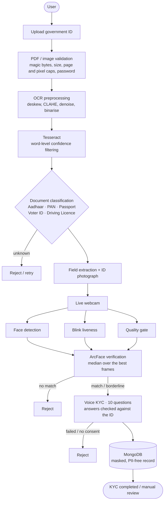

# Design notes

Why the system is built the way it is, what was measured, and where it stops being trustworthy.

## The flow

`session/engine.py` implements this as an explicit state machine
(`document -> liveness -> voice -> completed | rejected`). Recoverable problems (wrong file,
no blink yet, unclear answer) raise or return so the UI can retry; terminal decisions persist
the session and drop PII from memory.

## Document stage

**Rules, not a learned classifier.** Each ID type earns points from characteristic keywords and
from an ID-number pattern that also passes a structural check (Verhoeff checksum for Aadhaar,
holder-type letter for PAN, year sanity for driving licences). Every decision lists its evidence,
needs no labelled data and is robust to OCR noise because number formats are strong signals. The
trade-off: adding a new document type means writing rules.

**Checksum-gated OCR repair.** Tesseract confuses look-alike glyphs (`O`/`0`, `I`/`1`, `S`/`5`,
`B`/`8`). In a position where the format requires a digit we translate the glyph, then the
validator decides whether the repaired value is real. For Aadhaar the Verhoeff checksum makes this
safe: a repair that doesn't validate is discarded, never guessed. (Measured on rendered cards: a
licence read as `KAO1...` is recovered as `KA01...`.)

**Word-level confidence filtering.** Photos, holograms and card borders next to the text produce
short junk tokens (`i Name`, `| Cl RAHUL KUMAR`) that corrupt labels and names. Rebuilding lines from
`image_to_data` and dropping low-confidence words removed them. Digit-heavy tokens are kept even at
low confidence, because they can be validated afterwards while a dropped number is unrecoverable.
Between preprocessing variants the winner is chosen by total confidence *mass* (words x confidence),
not the mean: picking by mean let a variant that confidently read three words beat one that read thirty.

**Partial data is not an error.** If a field can't be read, the corresponding voice question is
*recorded*, not failed. We do not reject someone because our OCR missed a line. The 16-digit VID
printed next to an Aadhaar number is stripped before number extraction.

## Face stage

**Alignment was the biggest accuracy lever.** The first version cropped the detected box with a
25 % margin and levelled the eyes. On a tiny ID photo (~90 px face) that let a *different* person
score a distance of 0.46 against the ID photo, under the 0.68 threshold, i.e. a false accept, and
closer than the genuine pair. The fix is the geometry ArcFace was trained on: a 5-point similarity
transform (eyes, nose, mouth corners from YuNet) onto the canonical 112x112 template.

| pairs, ID photo shrunk to card size | box crop | 5-point alignment |
|---|---|---|
| impostor distances | 0.37 - 0.85 | 0.76 - 0.99 |
| genuine distances | 0.29 - 0.62 | 0.13 - 0.60 |
| gap (best impostor - worst genuine) | **-0.26** (overlap) | **+0.155** |

(A four-identity diagnostic, not a benchmark; see the README for the LFW numbers.)

**Three-way decision.** `match` / `review` / `no match` with a band around the threshold. Borderline
pairs go to a human instead of a coin flip, and the engine can be configured to reject them instead.

**Multi-frame matching.** The live capture keeps the 5 sharpest, eyes-open, quality-passing frames and
matches each against the ID photo; the median distance decides. One motion-blurred or half-blinking
frame can no longer sink (or rescue) a session.

**Quality gates are asymmetric.** The live selfie is hard-gated (blur, exposure, face size). The
ID photo is only *reported*: it is small and low-resolution by design.

## Liveness

**Blink detection** uses the eye aspect ratio (Soukupova & Cech, 2016) from MediaPipe's 478 face
landmarks. Choices that matter in practice:

* the threshold is relative to each person's own open-eye baseline (80th percentile of recent EAR),
  because glasses and eye shape move raw EAR a lot; a fixed 0.2 fails narrow eyes;
* durations use timestamps, not frame counts, so 10 fps and 60 fps webcams behave alike
  (tested at 10/15/30/60 fps);
* eyes held shut > 0.8 s is not a blink; single-sample jitter is not a blink;
* a lost face abandons a half-finished blink.

**What it does and does not stop.** A printed or still photo never dips and fails (verified with real
MediaPipe landmarks on a real face image). A *video replay* of the victim blinking, a 3-D mask or a
virtual-camera injection attack would pass a blink check. The optional DeepFace anti-spoof model
adds a passive layer against screen replays but is not a guarantee. Production systems add challenge
randomisation (random gestures, spoken digits), device attestation and human review.

## Voice stage

Ten questions, three kinds: **verify** (age, name, DOB, ID number, gender, address are compared with
what was read from the ID), **declare** (previous updates, bank linking: recorded for the audit
trail, nothing on an ID can confirm them) and **consent** (must be an explicit yes).

* Speech-to-text is offline (faster-whisper); no audio leaves the machine. Transcripts are judged and
  discarded, never stored.
* `parsing.py` normalises the many ways speech recognition writes an answer: "thirty two" / "32",
  "fifteenth of August nineteen ninety" / "15/08/1990", "A B C P E one two three four F" / NATO words.
* The document number tolerates one recognition slip (`number_max_edits=1`); a real document is still
  required to get within one edit of a 10-12 character value.
* A name printed partially (OCR dropped a token) matches if every printed token was spoken; a lone
  surname is deliberately not enough.
* Wrong or unclear answers get one retry; the session is rejected as soon as failures exceed the
  configured tolerance instead of interrogating the user to the end.
* Known weakness: consent is derived from the transcript containing an affirmative. In testing
  "yes, I consent" was once transcribed as "yes, I can sit" and still passed. Fine for a yes/no
  question; a regulated deployment would record the consent audio.

## Privacy model

Two halves of a session:

* **runtime** (memory only): extracted fields, ID photo, voice-flow state. Released the moment the
  session ends;
* **record** (what is persisted): stage, verdicts, scores, doc type, a *masked* ID number
  (`XXXXXX234F`), an HMAC-SHA256 of the ID for duplicate detection, and an audit trail.

No name, DOB, address, transcript, image or audio is stored. Tests assert this by serialising
the stored record and searching it for the PII strings. An ID already seen in an approved session
forces `manual_review`. Mongo records can auto-expire (`MONGO_TTL_DAYS`). Set `KYC_HASH_KEY`
in production: the default key is for development only.

## Limits and honest caveats

* **Not a regulated V-CIP.** India's RBI Video-based Customer Identification Process requires a live
  officer, geo-tagging, replay-resistant capture and more. This project demonstrates the technical
  pipeline; it is not compliant KYC and does not call UIDAI's authentication services.
* **Face matching is probabilistic.** Small, compressed ID photos raise error rates (measured in the
  README). Keep a human in the loop for consequential decisions.
* **OCR is English-first.** Hindi/regional text is not read (install extra Tesseract language data
  and set `KYC_OCR_LANG=eng+hin` to try). Field extraction is heuristic and layout-dependent.
* **Blink timing on real cameras is validated only on scripted signals and still images here.**
  Use `python -m videokyc.tools.blink_demo` to check thresholds on your own camera.
* MongoDB persistence is tested against `mongomock`, not a live server.
